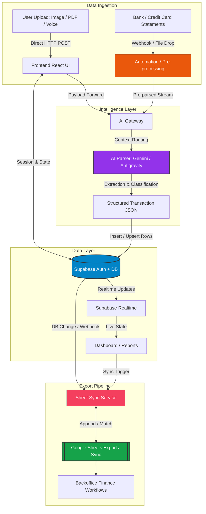
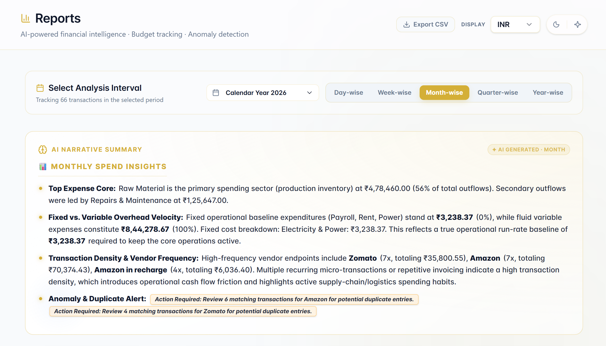
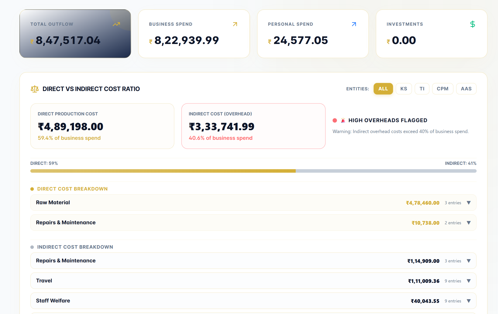
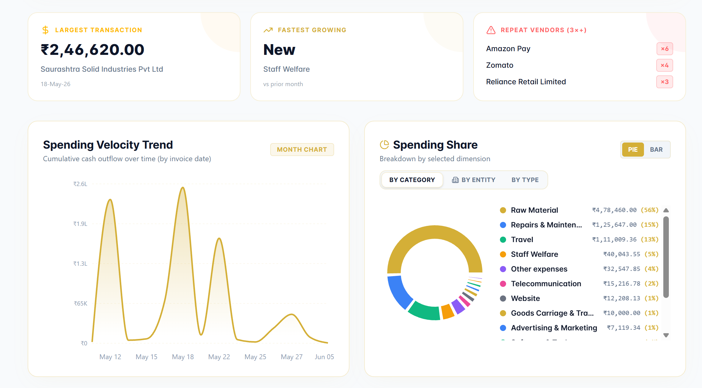
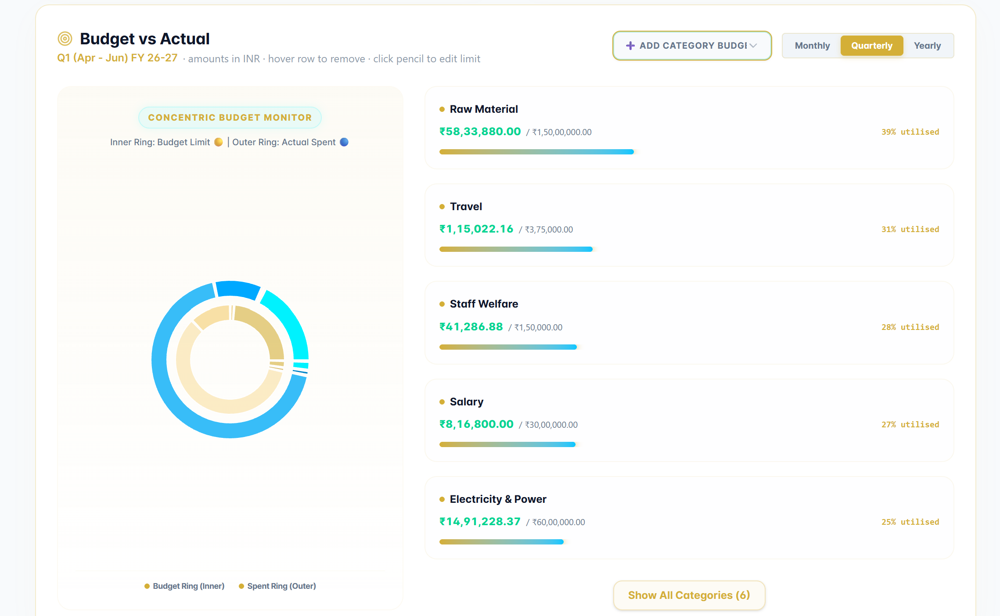

# FinStream AI

> Finstream AI is a premium customized AI-powered financial ledger SaaS prototype and cost intelligence platform built for corporate expense orchestration, statement parsing, and report automation, specially for Indian manufacturing businesses and multi-entity business owners. 

## 🚀 Product Overview

FinStream AI is a portfolio-ready fintech dashboard built to turn complex Credit-Card statements into clean, audit-ready ledgers. It replaces manual expense tracking through image, PDF, voice notes with a single intelligent dashboard accessible from any device in real time. The app combines AI-powered transaction parsing, Supabase-backed authentication and storage, multi-entity and multi-currency reporting, and Google Sheets sync.

## � Project Overview & Explainer

Get a complete visual breakdown of FinStream AI:


## �🎯 Problem Solved

Manual statement processing is slow, error-prone, and difficult to standardize across subsidiaries. FinStream AI solves this by:

- converting unstructured card statements into structured transactions
- adding a transaction simply by image, pdf or a voice note
- classifying costs into direct, indirect, and expenses categories
- syncing financial outputs to Google Sheets for fast stakeholder review
- giving finance teams a modern dashboard for expense oversight

## 🧩 Solution Architecture

This section describes the key data flow for FinStream AI: user ingestion, AI parsing, Supabase storage, realtime dashboard updates, and spreadsheet sync.



### Architecture Summary

- **Frontend:** React + Vite + TanStack Router + Tailwind
- **Data layer:** Supabase for auth, realtime updates, and Postgres storage
- **AI parsing:** `@ai-sdk/openai-compatible` with Google Gemini and Antigravity
- **Workflow automation:** Backend JSON workflows for statement processing and sheet export
- **Export:** Google Sheets integration for audit-friendly spreadsheets

## ✨ Key Features

- ✅ Secure Supabase authentication, signup, and password reset
- ✅ AI-driven credit card statement (It shouldnt be password protected) parsing
- ✅ Transaction extraction with vendor, date, amount, currency, category, and description of expense through image, pdf, voice note or narration
- ✅ Multi-entity / multi-currency financial ledger tracking
- ✅ Direct cost, indirect cost, and raw-material reporting
- ✅ Google Sheets export and automatic sync helpers
- ✅ Responsive dashboard with ledger charts and audit insights
- ✅ Bank statement workflow automation via backend integrations

## 🔄 Workflow Explanation

1. Users sign in using Supabase authentication.
2. Financial statements, bills, narrations are uploaded through the dashboard and sent to the AI parser.
3. The AI gateway normalizes the text and outputs a structured JSON transaction array.
4. Transactions are stored in Supabase and classified by business/personal category.
5. Users analyze costs across dashboards, reports, direct/indirect expenses, and transaction logs.
6. Finance teams can export or sync data to Google Sheets instantly.

## 🛠️ Tech Stack

- Frontend: `React`, `TypeScript`, `Vite`, `Tailwind CSS`
- Router / State: `@tanstack/react-router`, `@tanstack/react-query`
- Backend DB: `Supabase` (Auth, Realtime, Database)
- AI integration: `@ai-sdk/openai-compatible`
- AI providers: `Antigravity`, `Google Gemini`
- Data export: `Google Sheets`, n8n-style workflow JSON
- UI: Radix UI, `lucide-react`, `recharts`, `sonner`

## 💻 Installation Steps

```bash
cd "FrontEnd"
npm install
```

1. Copy `.env.example` to `.env` in `FrontEnd`.
2. Add Supabase and AI keys to `.env`.
3. Run the development server:

```bash
npm run dev
```

4. Open the local Vite URL shown in the terminal.

## 🔑 Environment Variables
Create a `.env` file in the root of the frontend directory (`FrontEnd/.env`) and add the following keys with your own credentials:

```env
# Supabase Database Keys
SUPABASE_URL="https://your-project-id.supabase.co"
SUPABASE_PUBLISHABLE_KEY="your-supabase-anonymous-key"
VITE_SUPABASE_URL="https://your-project-id.supabase.co"
VITE_SUPABASE_PUBLISHABLE_KEY="your-supabase-anonymous-key"
VITE_SUPABASE_PROJECT_ID="your-project-id"

# AI Service Keys (Gemini & Lovable)
LOVABLE_API_KEY="your-lovable-api-key"
GOOGLE_API_KEY="your-gemini-api-key"
GEMINI_API_KEY="your-gemini-api-key"

# n8n Automation Webhook
CAPTURE_WEBHOOK_URL="http://localhost:5678/webhook/capture-expense"
```

## 📸 Screenshots







## 🌐 Deployment Links

- **Project public URL:** https://tanstack-start-app.finstreamai.workers.dev/
- **Google Sheets sync demo:** https://docs.google.com/spreadsheets/d/1bHIPSsCFYGYcTG-AGqiuLIlZObOKh_Myn86o0bghvNk/edit?gid=0#gid=0

## 🚀 Future Roadmap

- GST input credit calculator + GSTIN tagging
- Build a native expense approval workflow
- WhatsApp alerts for budget breaches
- Tally export integration
- AI-powered CA assistant chatbot (RAG over past expenses)
- Direct Open Banking API integrations to automate ledger inputs — eliminating manual data entry entirely.
- Add user roles, permissions, and team management

## 👨‍💻 Creator Information

- **Creator:** FinStream AI Portfolio Project
- **Built by:** [Swati Maheshwari](https://github.com/swati1987-blip)
- **Contact:** swati@totalas.in

## 📄 License

This project is released under the **MIT License**.
