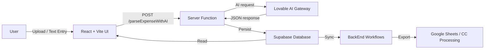
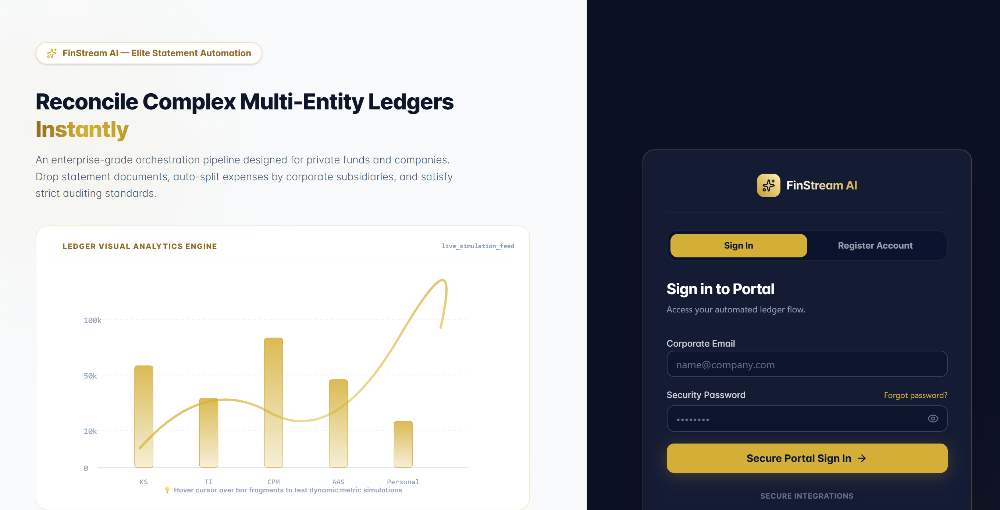
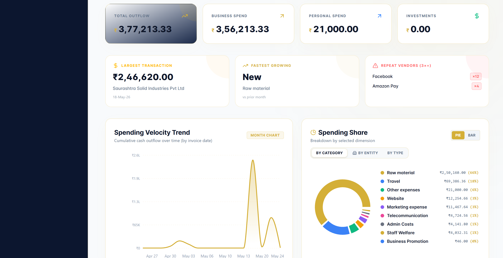
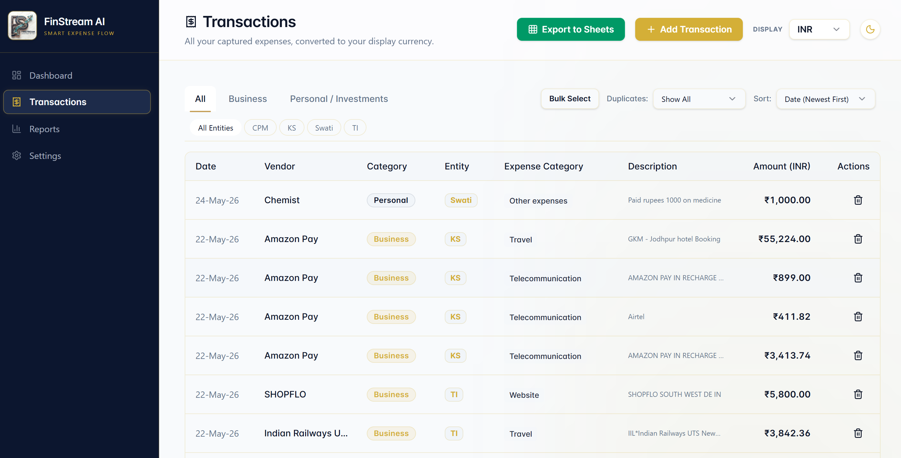
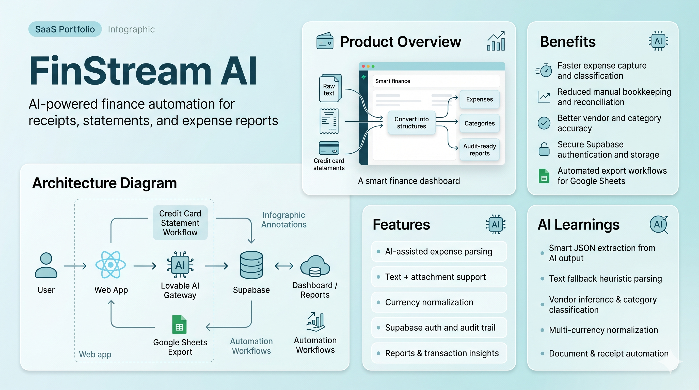
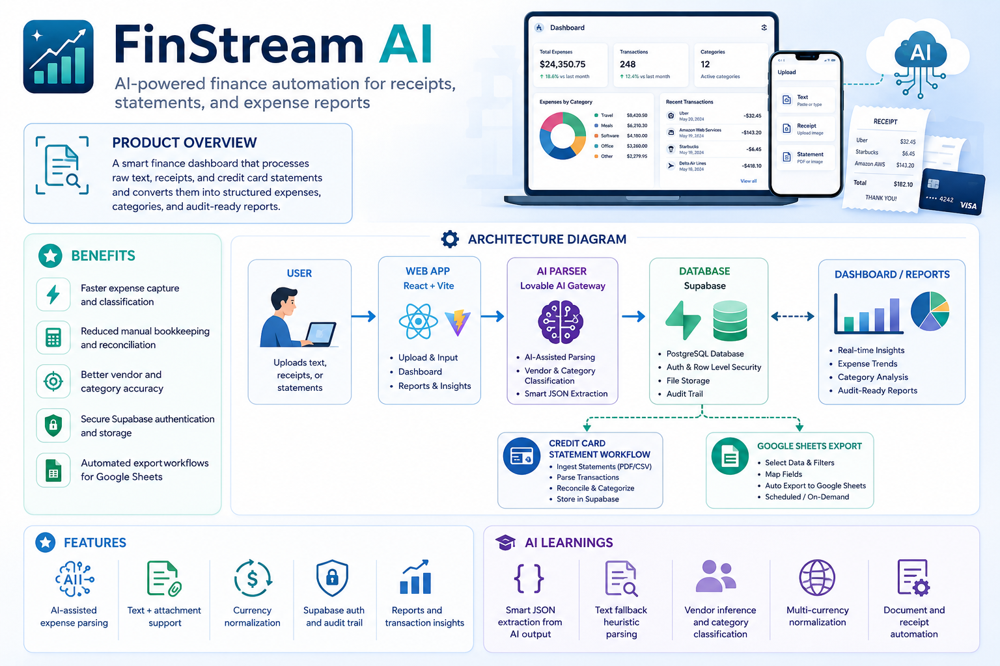

# FinStream AI

> FinStream AI is a portfolio-ready financial SaaS dashboard that turns receipts, credit card statements, and bills into structured expenses using AI, automation workflows, and Supabase-backed persistence.

---

## 🚀 Product Overview

FinStream AI is a modern expense intelligence platform built for small teams and finance operators. It combines:

- AI-driven expense extraction from text and attachments
- Supabase authentication and storage
- Real-time reporting dashboards
- Workflow automation for credit card statement processing and Google Sheets export

This project demonstrates how AI can eliminate manual bookkeeping and standardize expense workflows in one polished app.

---

## 🧩 Problem Solved

Many businesses still manage spend with manual entry, inconsistent expense classification, and disconnected automation. FinStream AI solves:

- Manual expense capture from receipts, invoices, and statements
- Poor vendor and category classification
- Multi-currency normalization challenges
- Lack of audit history and transaction rules memory
- Hard-to-maintain finance export workflows

---

## 🏛️ Solution Architecture



### Architecture Summary

- **Front-end:** `FrontEnd/` with React 19, Vite, TanStack Router, Tailwind, and Supabase client integration
- **AI layer:** `FrontEnd/src/lib/ai-gateway.ts` uses `@ai-sdk/openai-compatible` and Lovable AI gateway
- **Parse engine:** `FrontEnd/src/lib/expenses.functions.ts` parses text, attachments, and fallback logic
- **Database:** Supabase data persistence and auth via `FrontEnd/src/integrations/supabase`
- **Automation:** `BackEnd/` stores workflow definitions for credit card processing and Google Sheets export

---

## ✨ Core Features

- AI-assisted expense parsing from raw text input
- Receipt and invoice attachment support
- Currency detection and normalization across major fiat currencies
- Supabase-authenticated login, signup, password recovery
- Real-time expense dashboard and transaction reports
- Audit log support and transaction rule memory
- Expense import via master upload
- Export-ready workflow automations for Google Sheets

---

## 🔄 Workflow Explanation

1. **User signs in** through Supabase auth
2. **Upload receipt or enter expense text** on the dashboard
3. **Server-side expense parser** validates input and calls AI if needed
4. **Structured expense objects** are saved into Supabase
5. **Dashboard charts and reports** visualize spend categories, vendors, and audits
6. **Automation workflows** process credit card statements and export results to Google Sheets

---

## 🛠️ Tech Stack

- React 19
- TypeScript
- Vite
- Tailwind CSS 4
- Supabase Auth + Database
- TanStack Router + React Query + React Start
- `@ai-sdk/openai-compatible`
- `ai` package
- Radix UI
- Recharts
- PDF.js

---

## ⚙️ Installation

```bash
git clone https://github.com/yourusername/finstream-ai.git
cd "Finstream AI"/FrontEnd
npm install
```

### Run locally

```bash
npm run dev
```

### Build for production

```bash
npm run build
npm run preview
```

---

## 🔐 Environment Variables

Create a `.env` file in `FrontEnd/` with the following values:

```bash
SUPABASE_URL=https://your-supabase-project.supabase.co
SUPABASE_PUBLISHABLE_KEY=REPLACE_WITH_SUPABASE_PUBLISHABLE_KEY
VITE_SUPABASE_URL=https://your-supabase-project.supabase.co
VITE_SUPABASE_PUBLISHABLE_KEY=REPLACE_WITH_VITE_SUPABASE_PUBLISHABLE_KEY
SUPABASE_SERVICE_ROLE_KEY=REPLACE_WITH_SUPABASE_SERVICE_ROLE_KEY
LOVABLE_API_KEY=REPLACE_WITH_YOUR_LOVABLE_API_KEY
```

> Note: Keep server keys like `SUPABASE_SERVICE_ROLE_KEY` private and do not expose them in client-side code.

---

## 🖼️ Screenshots












---

## 🎬 GIF Demo

> Replace these demo links with real project animations once available.


---

## 🌐 Deployment Links

- Live app: `https://your-deployment-url.com`
- Automation dashboard: `https://your-automation-url.com`
- GitHub repo: `https://github.com/yourusername/finstream-ai`

---

## 🚀 Future Roadmap

- Add OCR-based PDF/receipt text extraction
- Enhance document parsing for invoices and bank statements
- Add Slack / email notification workflows
- Build mobile-friendly app and PWA support
- Add budgeting, forecasting, and approval workflows
- Expand rule automation to handle multi-entity finance operations

---

## 👤 Creator

Built as a modern AI SaaS showcase with finance automation and data-driven UX.

- **Creator:** [Your Name]
- **Portfolio:** `https://your-portfolio.example.com`
- **Email:** `your.email@example.com`

---

## 📄 License

This project is released under the **MIT License**.
