# FinStream AI

> A premium AI-powered financial ledger SaaS prototype for corporate expense orchestration, statement parsing, and report automation.

## 🚀 Product Overview

FinStream AI is a portfolio-ready fintech dashboard built to turn complex Credit-Card statements into clean, audit-ready ledgers. The app combines AI-powered transaction parsing, Supabase-backed authentication and storage, multi-entity reporting, and Google Sheets sync.

## � Project Overview & Explainer

Get a complete visual breakdown of FinStream AI:

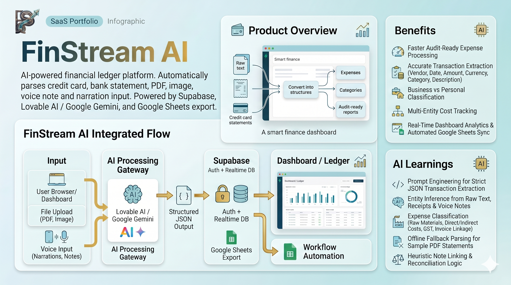
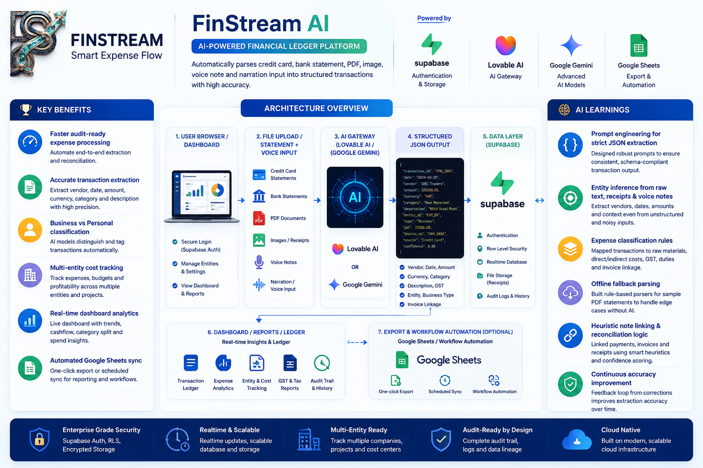


## �🎯 Problem Solved

Manual statement processing is slow, error-prone, and difficult to standardize across subsidiaries. FinStream AI solves this by:

- converting unstructured card/bank statements into structured transactions
- adding a transaction simply by image, pdf or a voice note
- classifying costs into direct, indirect, and expenses categories
- syncing financial outputs to Google Sheets for fast stakeholder review
- giving finance teams a modern dashboard for expense oversight

## 🧩 Solution Architecture

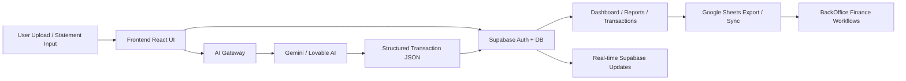

### Architecture Summary

- **Frontend:** React + Vite + TanStack Router + Tailwind
- **Data layer:** Supabase for auth, realtime updates, and Postgres storage
- **AI parsing:** `@ai-sdk/openai-compatible` with Lovable or Google Gemini providers
- **Workflow automation:** Backend JSON workflows for statement processing and sheet export
- **Export:** Google Sheets integration for audit-friendly spreadsheets

## ✨ Key Features

- ✅ Secure Supabase authentication, signup, and password reset
- ✅ AI-driven bank/credit card statement parsing
- ✅ Transaction extraction with vendor, date, amount, currency, category, and description of expense through image, pdf, voice note or narration
- ✅ Multi-entity / multi-currency financial ledger tracking
- ✅ Direct cost, indirect cost, and raw-material reporting
- ✅ Google Sheets export and automatic sync helpers
- ✅ Responsive dashboard with ledger charts and audit insights
- ✅ Bank statement workflow automation via backend integrations

## 🔄 Workflow Explanation

1. Users sign in using Supabase authentication.
2. Financial statements, bills, narrations are uploaded through the dashboard and sent to the AI parser.
3. The AI gateway normalizes the text and outputs a structured JSON transaction array.
4. Transactions are stored in Supabase and classified by business category.
5. Users analyze costs across dashboards, reports, direct/indirect expenses, and transaction logs.
6. Finance teams can export or sync data to Google Sheets instantly.

## 🛠️ Tech Stack

- Frontend: `React`, `TypeScript`, `Vite`, `Tailwind CSS`
- Router / State: `@tanstack/react-router`, `@tanstack/react-query`
- Backend DB: `Supabase` (Auth, Realtime, Database)
- AI integration: `@ai-sdk/openai-compatible`
- AI providers: `Lovable AI`, `Google Gemini`
- Data export: `Google Sheets`, n8n-style workflow JSON
- UI: Radix UI, `lucide-react`, `recharts`, `sonner`

## 💻 Installation Steps

```bash
cd "FrontEnd"
npm install
```

1. Copy `.env.example` to `.env` in `FrontEnd`.
2. Add Supabase and AI keys to `.env`.
3. Run the development server:

```bash
npm run dev
```

4. Open the local Vite URL shown in the terminal.

## 🔑 Environment Variables

Add the following variables for the frontend and server integration:

```env
VITE_SUPABASE_URL="https://your-supabase-project.supabase.co"
VITE_SUPABASE_PUBLISHABLE_KEY="your-supabase-publishable-key"
VITE_SUPABASE_PROJECT_ID="your-supabase-project-id"
SUPABASE_URL="https://your-supabase-project.supabase.co"
SUPABASE_PUBLISHABLE_KEY="your-supabase-publishable-key"
SUPABASE_SERVICE_ROLE_KEY="your-supabase-service-role-key"
LOVABLE_API_KEY="your-lovable-or-google-api-key"
GOOGLE_GEMINI_API_KEY="your-google-gemini-api-key"
```

> Note: For client-side usage, `VITE_` variables are exposed to the browser. Keep all server-side secrets in a secure environment.

## 📸 Screenshots

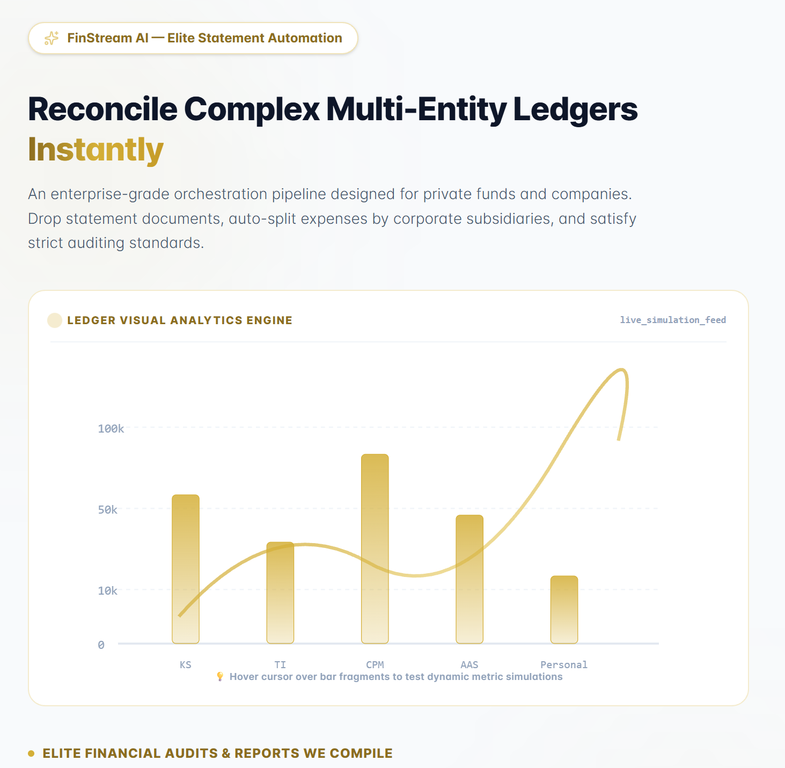
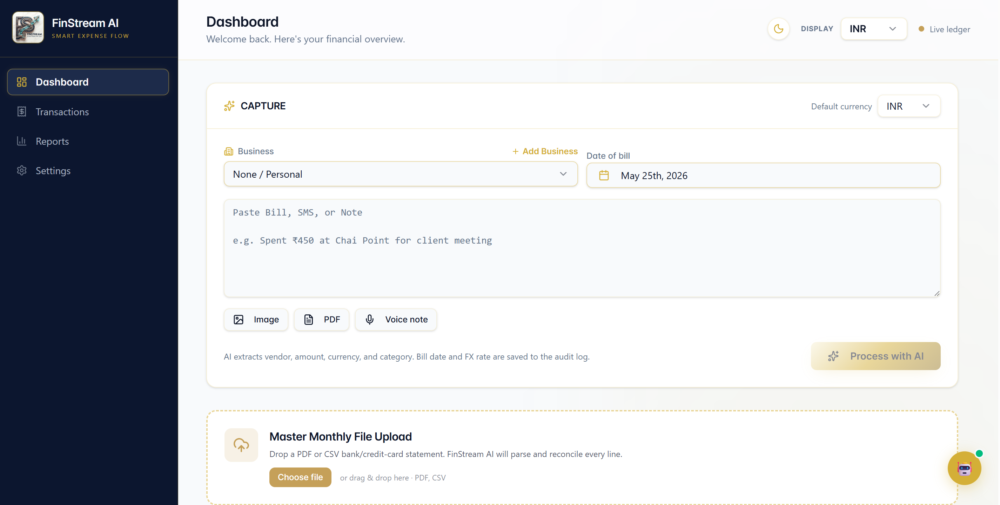
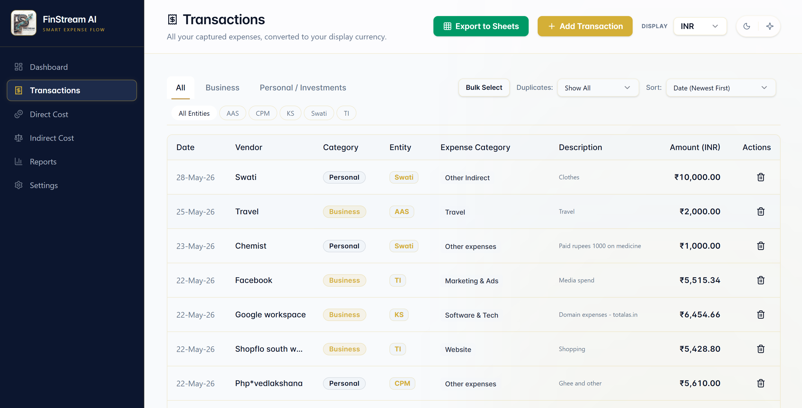
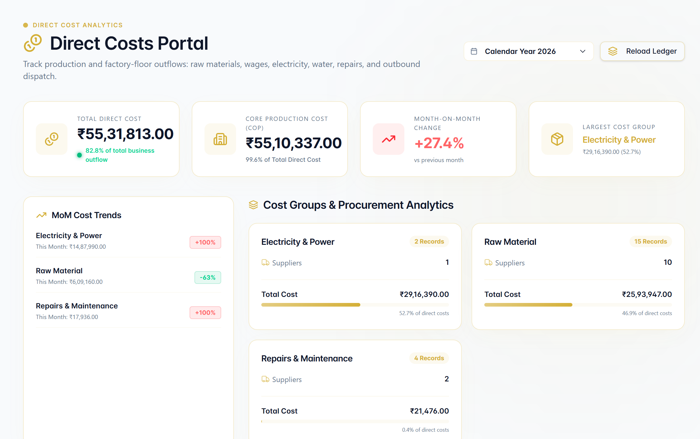
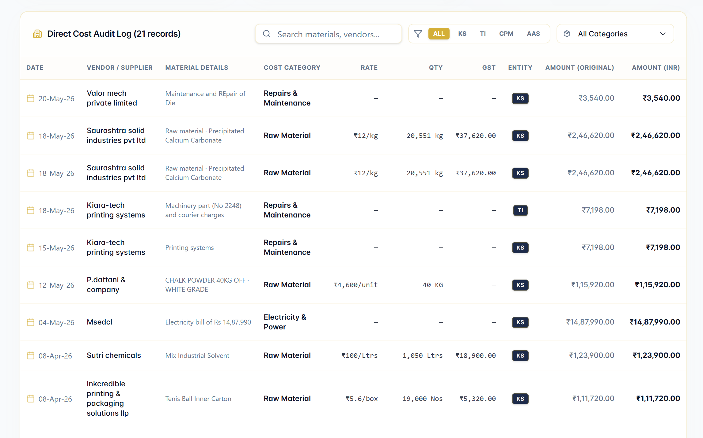
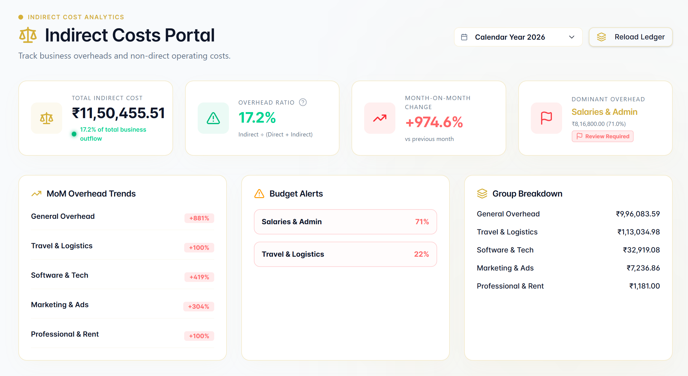
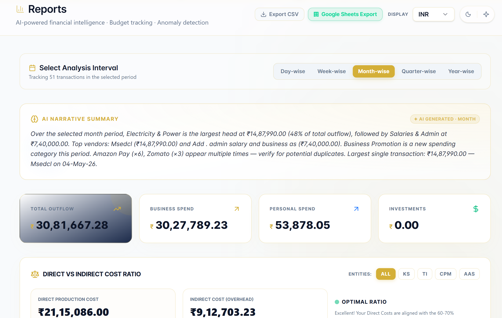
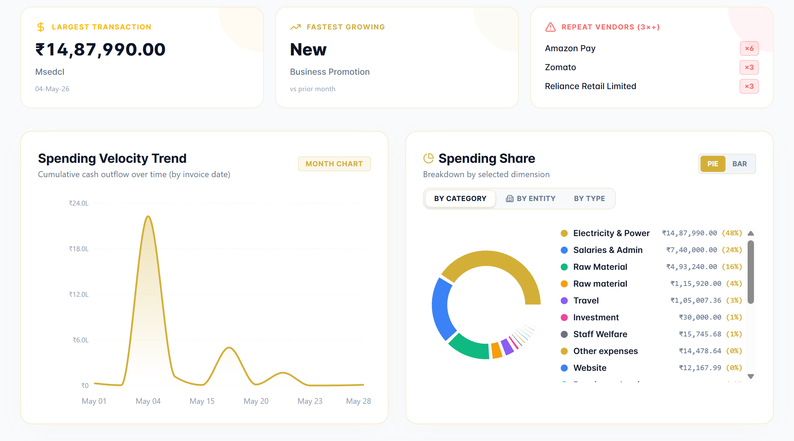
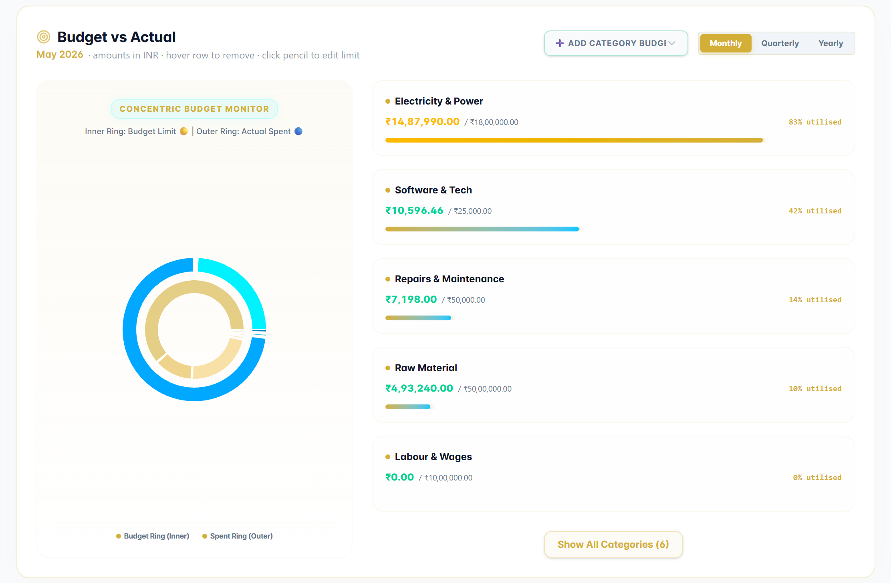

## 🎥 GIF Demos

> Add animated workflow demos to the repo once available.

- `Screenshots/finstreamai-dashboard-demo.gif`
- `Screenshots/finstreamai-upload-workflow.gif`
- `Screenshots/finstreamai-google-sheets-sync.gif`

## 🌐 Deployment Links

- **Live demo:** `https://finstream-ai.example.com`
- **Public login page:** `https://tanstack-start-app.finstreamai.workers.dev/login`
- **Staging preview:** `https://staging.finstream-ai.example.com`
- **Google Sheets sync demo:** `https://docs.google.com/spreadsheets/d/YOUR_SHEET_ID`

> Replace the placeholder links with your actual deployment URLs before publishing.

## 🚀 Future Roadmap

- Add full Excel / PDF statement ingestion support
- Build a native expense approval workflow
- Add advanced audit trail reporting for C-suite review
- Add multi-currency conversion and analytics
- Add webhook connectors for ERP and bank feeds
- Add user roles, permissions, and team management

## 👨‍💻 Creator Information

- **Creator:** FinStream AI Portfolio Project
- **Built by:** [Swati Maheshwari](https://github.com/swati1987-blip)
- **Contact:** swati@totalas.in

## 📄 License

This project is released under the **MIT License**.
